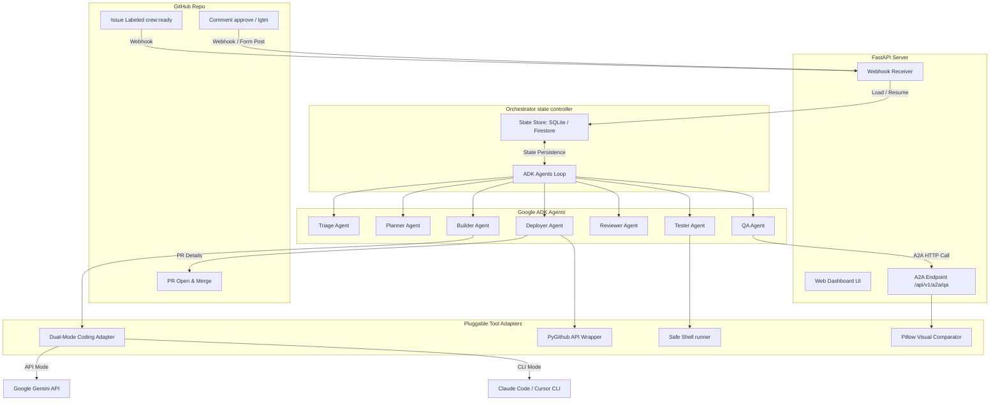

# 🚀 Founders.crew — Virtual AI DevOps Team

> An event-driven, multi-agent DevOps team built on **Google ADK** and the **Agent-to-Agent (A2A) Protocol**. Autonomously triages GitHub issues, plans architecturally, codes fixes, executes tests, compares visual outputs (QA), and opens PRs — with human approval gates at every critical milestone.

Targeted for **Track 3 (Production & Cloud Deploy)** of the Google for Startups AI Agents Challenge.

---

## 🎨 System Architecture



---

## ✨ Key Features

1. **🧙 Frictionless Interactive Onboarding**: A guided 5-step terminal wizard (`founders-crew setup`) that connects to GitHub via OAuth Device Flow and authorizes Gemini API keys. No manual `.env` file management.
2. **🏥 System Health Doctor (`founders-crew doctor`)**: Diagnostics CLI that runs end-to-end integration pings, credential checks, and tool availability status.
3. **💾 Cloud Run Ready Persistence**: State Store supporting SQLite for local runs and **Google Cloud Firestore** for stateless Cloud Run persistence across cold starts.
4. **🔌 Dual-Mode Coding Adapter**: Seamlessly toggles between local CLI subprocesses (Cursor, Claude Code) and direct API edits (via LiteLLM/Gemini) inside headless Docker containers.
5. **👁️ Visual QA Verification**: Playwright browser captures and Pillow pixel similarity comparators that calculate visual difference scores.
6. **🤝 A2A JSON-RPC Endpoint**: Exposes the QA Agent as a JSON-RPC 2.0 conformant service at `/api/v1/a2a/qa` which the Builder Agent requests to run visual layout regression checks.
7. **💻 Responsive Web Dashboard**: Beautiful, dark-themed Jinja2 + HTMX console for tracking agent history, viewing plans/visual reports, and executing approvals.
8. **📜 Rotating System Log Console**: Centralized, size-capped operational logging (configured with `RotatingFileHandler` writing to `~/.founderscrew/logs/founderscrew.log`). Integrates Uvicorn/FastAPI operational outputs and streams a real-time log viewer inside the web dashboard.

---

## 🚀 Quickstart Guide

### 1. Installation
Clone this repository and install inside an isolated virtual environment:
```bash
# Create and activate virtual environment
python -m venv .venv
.\.venv\Scripts\activate

# Install editable package and dependencies
pip install -e .
```

### 2. Configure via Wizard
Run the setup wizard to connect to GitHub and your Google Cloud credentials:
```bash
founders-crew setup
```

### 3. Run System Diagnostics
Run the doctor command to verify your configuration and tokens:
```bash
founders-crew doctor
```

### 4. Launch the Web Console
Start the webhook and web dashboard server locally:
```bash
founders-crew start
```
Go to `http://localhost:8080` to access the dashboard!

---

## 🐳 Deploying to Google Cloud Run

This project is optimized for a stateless deployment on Cloud Run.

### 1. Build and Push Container
Create the Artifact Registry repository and build your image:
```bash
# Configure docker credentials
gcloud auth configure-docker us-central1-docker.pkg.dev

# Build and push
docker build -t us-central1-docker.pkg.dev/YOUR_PROJECT/founders-crew/app:latest .
docker push us-central1-docker.pkg.dev/YOUR_PROJECT/founders-crew/app:latest
```

### 2. Deploy to Cloud Run
Deploy with Firestore state storage:
```bash
gcloud run deploy founders-crew \
  --image us-central1-docker.pkg.dev/YOUR_PROJECT/founders-crew/app:latest \
  --region us-central1 \
  --allow-unauthenticated \
  --set-env-vars FOUNDERSCREW_STORAGE_BACKEND=firestore,GOOGLE_CLOUD_PROJECT=YOUR_PROJECT
```

---

## 🤝 Agent-to-Agent (A2A) Specifications

The QA Agent exposes an A2A agent card at `/.well-known/agent-card.json` and supports JSON-RPC 2.0 calls.

### Request Payload:
```json
{
  "jsonrpc": "2.0",
  "method": "execute_qa",
  "params": {
    "url": "http://localhost:3000"
  },
  "id": 1
}
```

### Response Payload:
```json
{
  "jsonrpc": "2.0",
  "result": {
    "passed": true,
    "similarity_percentage": 98.5,
    "observations": "Page renders correctly. Minor 1.5% pixel change in footer."
  },
  "id": 1
}
```

---

## 🧪 Running the Test Suite
We maintain a suite of 42 unit tests covering state stores, A2A endpoints, agents setup, rotating logging configuration, and UI routers:
```bash
python -m pytest
```

---

## 🎥 Video Demonstration
A <= 3 minutes video walkthrough is available at: [Link Placeholder]
